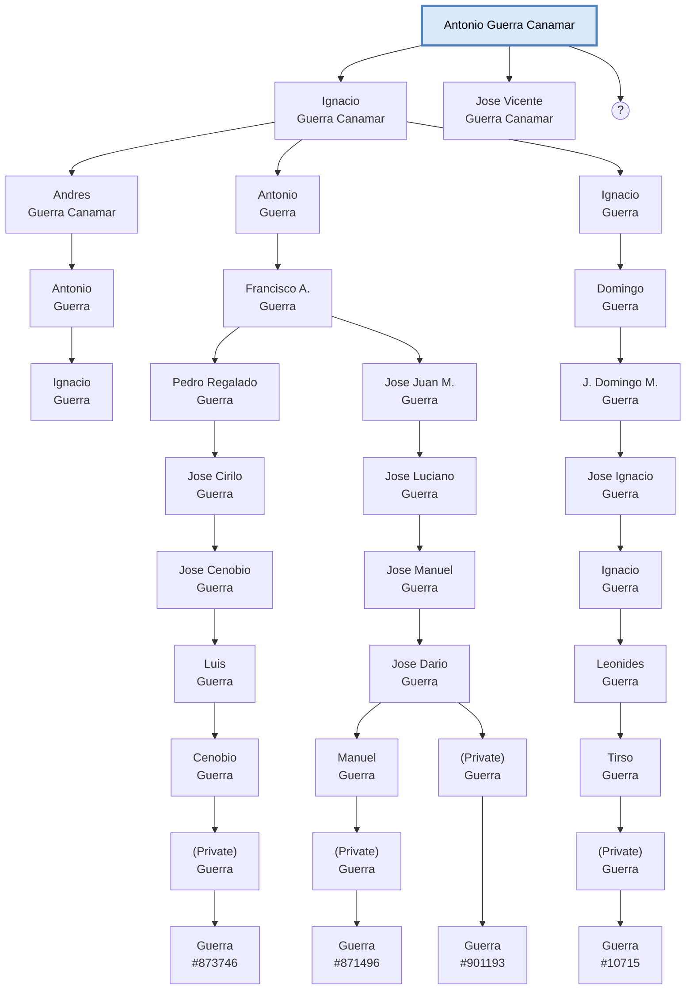

```mermaid
 flowchart TD
  a1[Antonio Guerra Canamar] --> a2[Ignacio<br>Guerra Canamar] & a3[Jose Vicente<br>Guerra Canamar] & a?((?))
  a2 --> a4[Antonio<br>Guerra] & a19[Ignacio<br>Guerra] & a27[Andres<br>Guerra Canamar]
  a27 --> a28[Antonio<br>Guerra]
  a28 --> a29[Ignacio<br>Guerra]
  a19 --> a20[Domingo<br>Guerra]
  a20 --> a21[J. Domingo M.<br>Guerra]
  a21 --> a22[Jose Ignacio<br>Guerra]
  a22 --> a23[Ignacio<br>Guerra]
  a23 --> a24[Leonides<br>Guerra]
  a24 --> a25[Tirso<br>Guerra]
  a25 --> a26["(Private)<br>Guerra"]
  a26 --> d4[Guerra<br>#10715]
  a4 --> a5[Francisco A.<br>Guerra]
  a5 --> a6[Pedro Regalado<br>Guerra] & a7[Jose Juan M.<br>Guerra]
  a6 --> a8[Jose Cirilo <br>Guerra]
  a8 --> a9[Jose Cenobio<br>Guerra]
  a9 --> a10[Luis<br>Guerra]
  a10 --> a11[Cenobio<br>Guerra]
  a11 --> a12["(Private)<br>Guerra"]
  a12 --> d1[Guerra<br>#873746]
  a7 --> a13[Jose Luciano<br>Guerra]
  a13 --> a14[Jose Manuel<br>Guerra]
  a14 --> a15[Jose Dario<br>Guerra]
  a15 --> a16[Manuel<br>Guerra] & a18["(Private)<br>Guerra"]
  a16 --> a17["(Private)<br>Guerra"]
  a17 --> d2[Guerra<br>#871496]
  a18 ---> d3[Guerra<br>#901193]
  style a1 fill:#DAE8FC,color:#000,stroke:#517FB9,stroke-width:3px 
```
